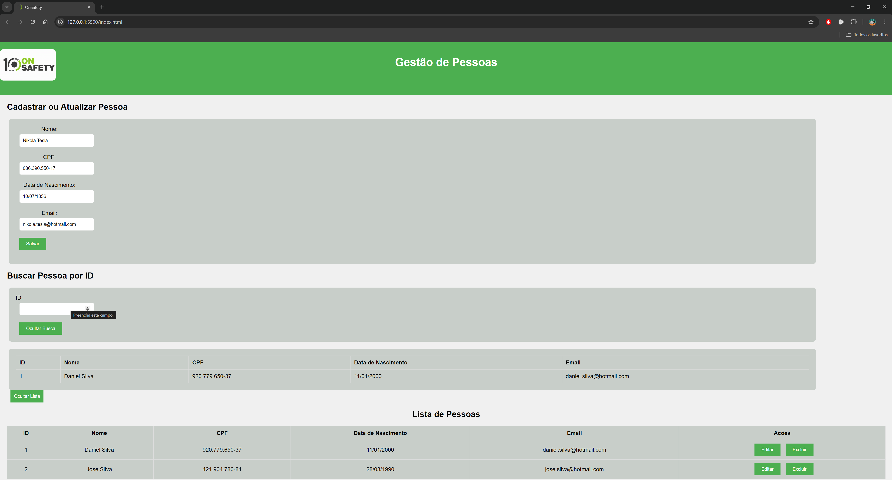

---

# Fase Final do Processo Seletivo
**Dev Júnior OnSafety**  
19 de julho de 2024

## Visão Geral
Estamos na quarta fase do processo seletivo para a vaga de Programador Júnior na OnSafety. Esta é a última etapa do nosso processo, com o objetivo de avaliar a lógica de programação, organização do código e a sua forma de programar.

## Objetivos
1. Desenvolver uma aplicação web para gestão de pessoas.
2. Disponibilizar o código completo do projeto em um repositório GIT.

## Especificações
A aplicação deve ser uma API REST, com os dados persistidos em um banco de dados, e deve ter uma interface que permita o CRUD dos registros. A aplicação deve configurar automaticamente sua base na inicialização ou conter um README com os passos necessários para sua execução correta.

A aplicação deve incluir, no mínimo:
- Uma validação na interface.
- Uma validação na API.
- Uma validação no banco de dados.
- Validação e formatação do CPF.

### Classe Pessoa

 ```mermaid

classDiagram
class Pessoa{
-Long id
-String nome
-String cpf
-LocalDate dataNascimento
-String email

}

```
## Requisitos
Você deve ter instalado em seu computador:
- **Java 17** - [Download do JDK 17](https://www.oracle.com/br/java/technologies/downloads/#jdk17)
- **MySQL Community Server 9.0.1 Innovation** - [Download do MySQL Community Server](https://dev.mysql.com/downloads/mysql/)
- **MySQL Workbench 8.0 CE** - [Download do MySQL Workbench](https://dev.mysql.com/downloads/workbench/)
- **IDE para Back-End** de sua preferência com suporte para Spring Boot (Spring Tool Suite, Eclipse, IntelliJ IDEA, NetBeans, etc.)
- **IDE para Front-End** - Visual Studio Code

## Como Executar Este Projeto
1. Instale o Java JDK 17.
2. Instale o MySQL Community Server 9.0.1 Innovation.
3. Instale o MySQL Workbench 8.0 CE e configure seu usuário e senha.
4. Clone o repositório usando o comando:
    ```bash
    $ git clone https://github.com/LeonardoSiqueira01/OnSafety---Projeto.git
    ```
5. Abra o MySQL Workbench e crie um banco de dados chamado `onsafety`.
6. Configure o banco de dados em `src/main/resources/application.properties`, utilizando as credenciais:
   ```properties
   spring.datasource.username=seu-usuario-aqui
   spring.datasource.password=sua-senha-aqui
   ```
7. Execute o projeto na sua IDE preferida.
8. Acesse a rota da API para o back-end: [http://localhost:8080/pessoas](http://localhost:8080/pessoas)  
   (Por padrão, a aplicação utiliza a porta 8080, mas você pode alterá-la no `application.properties` com a opção `server.port`.)
9. Para executar a parte do projeto front-end, abra o arquivo `index.html` localizado em `Onsafety - front end/index.html` no seu navegador (de preferência o Google Chrome).
10. A porta configurada para executar os comandos CRUD no front-end, contidos em `Onsafety - front end/js/script.js`, utiliza os métodos na rota da API do back-end. Portanto, se você usar uma porta diferente de 8080, lembre-se de alterá-la também no arquivo `script.js`.

## Funções Realizadas Pelo Programa
- **Cadastrar Pessoa**
- **Editar Pessoa**
- **Buscar Pessoa por ID**
- **Buscar Todas Pessoas**
- **Deletar Pessoa por ID**



---
